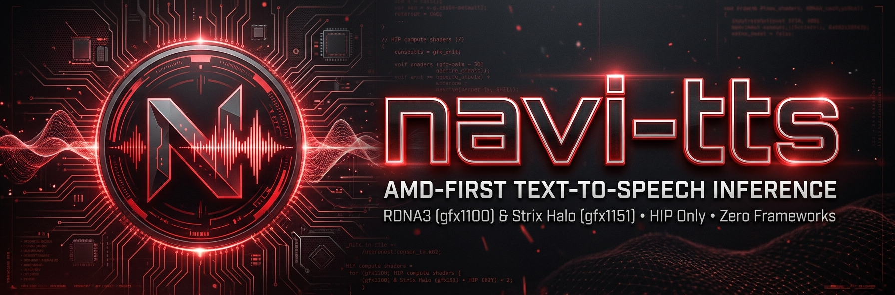

# navi-tts

**AMD-first text-to-speech inference. RDNA3 (gfx1100) and Strix Halo (gfx1151), HIP only, tuned and measured. Other hardware is out of scope by design.**

A small, focused engine: one binary, no CPU or Vulkan fallback, no framework
underneath. The hot loop is hand-written HIP; the model runs at batch one and is
memory-bandwidth-bound, so the kernels are built around that.

| Target | GPU | ROCm | ms/frame | Vocoder | TTFA | RTF | Build |
|---|---|---|---|---|---|---|---|
| Workstation | Radeon RX 7900 XTX (gfx1100, 96 CU) | ≥ 10.1 (built with 10.1.0) | 6.13 ms | 0.62 ms/frame | 34 ms | 0.086 | `f418d80` ×3 |
| Mini PC | Strix Halo (gfx1151, 40 CU) | ≥ 10.1 (built with 10.1.0) | 20.10 ms | 1.27 ms/frame | 98 ms | 0.271 | `dc29812` ×3 |

*(Generated by `tools/bench_table.py` from `bench/results.jsonl`: the median over the latest clean build's runs, bench text + seed 2, `voice_1`, the streaming batch configuration as served.)*

Resident memory of the running engine, measured from the amdgpu per-process
accounting (`/proc/<pid>/fdinfo`, 2026-10-07): the 1.92 GiB weight blob plus
vocoder, activations and warm-up state comes to **~2.7 GiB** on both targets -
as VRAM on the XTX (2.67 GiB, GTT negligible), and as GTT - shared system RAM -
on Strix Halo (2.68 GiB, the APU's carve-out VRAM stays at ~10 MiB). Cloned
voices in the voices dir add only their reference embeddings (~KB each).

## Build (workstation; `--preset strix` on the mini PC, see `docs/reference/toolchain.md`)

    cmake --preset xtx && cmake --build --preset xtx
    ./build/xtx/navi-tts info --model models/qwen3-tts-0.6b-f16.navi --upload
    ctest --preset xtx          # parity gates against tests/reference
    tests/runaway.sh 8090       # against a side-port serve: EOS, cap, bit-exact, parallel clients
    tests/contention.sh 8090    # the same while build/xtx/gpu_hog saturates the card (briefly)
    ./build/xtx/navi-tts synth --model models/qwen3-tts-0.6b-f16.navi --voice ref.wav --text "Hello." --seed 2 --out hello.wav
    ./build/xtx/navi-tts serve --model models/qwen3-tts-0.6b-f16.navi --port 8090 -V

Cloned voices persist in `~/.local/share/navi-tts/voices` (`--voices DIR`),
one directory per voice named after the registered name, and load at start;
`POST /v1/audio/voices` with the same name and sample is a no-op, a new sample
replaces. Reference audio at any rate is resampled to 24 kHz. Offline, without
the server:

    ./build/xtx/navi-tts voices add --model models/qwen3-tts-0.6b-f16.navi --name voice_1 --voice nyx.wav
    ./build/xtx/navi-tts voices list
    ./build/xtx/navi-tts voices rm voice_1

The preset picks the ROCm clang from `~/tools/therock-tarball/install` for
host and device code; no `hipcc`, no system compiler. Weights are converted
once, offline:

    cd tools && uv sync && uv run convert.py ../models/Qwen3-TTS-12Hz-0.6B-Base ../models/qwen3-tts-0.6b-f16.navi

(`--codec-dtype f32` keeps the vocoder at float32: bit-closer to PyTorch, ~2x
the vocoder time, not audible - DESIGN 6.)

`docs/DESIGN.md` is the design, `docs/model.md` the model, `docs/navi-format.md`
the weight file.

## Scope

- **Model:** Qwen3-TTS architecture (0.6B), own weight format converted offline.
  Fine-tunes of the same architecture are just different weights.
- **Bind:** `--host` defaults to `127.0.0.1`; the production unit passes
  `0.0.0.0` to serve the LAN (no auth on any endpoint - LAN-trusted, same
  tradeoff as the TTS-Player queue's daemon).
- **API:** OpenAI-compatible `/v1/audio/speech` and `/v1/audio/voices` on `:8080`,
  plus the XTTS dialect SkyrimNet speaks (`/create_and_store_latents`,
  `/tts_to_audio/`, `/speakers`, ...) on the same port and, with
  `--xtts-port 8020`, on the port SkyrimNet's `XTTS.yaml` already names.
  Cloned voices persist across restarts. `/v1/audio/speech` streams with
  `stream_format: "audio"` (chunked WAV or, with `response_format: "pcm"`, raw
  s16le) or `"sse"` (base64 PCM events, then `speech.audio.done` with the
  timings); the first chunk is 4 frames (~70 ms to first audio), then
  `stream_batch_size` (default 16). Batching never changes the PCM.
  `GET /metrics` is Prometheus text (`tts:` counters per stage, TTFA and RTF
  histograms, `_last` gauges) for the node_exporter textfile collector.
- **Serves:** [TTS-Player](../TTS-Player) (queue, Claude Code / opencode cues) and SkyrimNet.
  Production is the `navi-tts.service` user unit: `serve --host 0.0.0.0 --port 8080
  --xtts-port 8020 --max-frames 600` with the voices dir above, which holds the
  cloned voices plus the Skyrim voice pack the queue exposes by name.

## License

The code in this repository is AGPL-3.0-only (`LICENSE`). Model weights are not
part of it: the Hugging Face `Qwen3-TTS-12Hz-0.6B-Base` artifacts and the
`.navi` blobs converted from them are separate works under the Qwen Community
License 1.0 (`models/README.md`).

## Lineage

Written from scratch. The Qwen3-TTS model was first brought to GGML by
[predict-woo/qwen3-tts.cpp](https://github.com/predict-woo/qwen3-tts.cpp), extended by
[khimaros/qwen3-tts.cpp](https://github.com/khimaros/qwen3-tts.cpp); this project shares
no code with either but owes them the map of the model. `HISTORY.md` records the
discrete-GPU/HIP work that preceded this rewrite.
